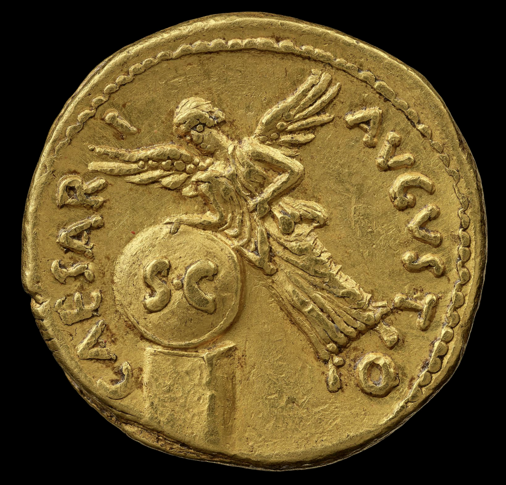
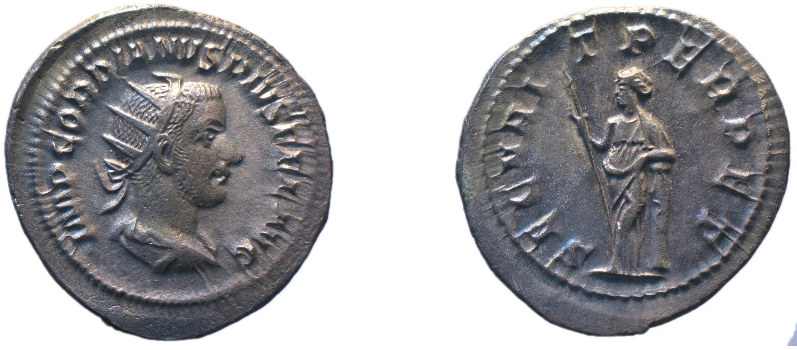

# Adjectives: self-correcting exercise

## Background

These coins do not distinguish *I* from *J*, or *U* from *V*.

Names are also nouns, with forms you can identify by gender, case and number. (In fact, the Latin word *nomen* means both "name" and "noun", and is the source for the English word "noun.")

## Recognizing names

Nom. s, gen. s.

- Claudius
- Trajan
- Julia Augusta
- Faustina

### Julia

[Julia Domna](https://en.wikipedia.org/wiki/Julia_Domna)

Born in Emesa (present-day Homs), married Septimius Severus (born in Libya)

RIC IV Septimius Severus 554 (denarius)

| Obverse | Reverse |
| --- | -- |
|   **IVLIA AVGVSTA** |  FORTVNAE FELICI |

###  Faustina

[Faustina](https://en.wikipedia.org/wiki/Faustina_the_Elder) (the Elder)

 RIC3 AntP 510

 Niece of the emperor Hadrian, aunt of the later emperor Marcus Aurelius.

| Obverse | Reverse |
| --- | -- |
|  **FAUVSTINA AVG[VSTA] ANTONINI AVG[VSTI] PII FIL[IA]** |  **VENERI FELICI** |

## Dedicatory texts

In the dative

| --- | --- | --- |
| ) CAESARI AVGVSTO |  OPTIMO PRINCIPI | DIVO TRAIANO PATRI|
|RIC I (second edition) Augustus 321 | RIC II Trajan 150 | (RIC II, Part 3 (second edition) Hadrian 27) |

ric2_3_hadr27.png

SECVRITAS PERPETVA RIC IV Gordian III 152
CC BY-NC-SA 4.0)

ROMAE AETERNAE
ric3_comm_195a.png

RIC II, Part 1 (second edition) Vespasian 605
VICTORIA NAVALIS

or

RIC II, Part 1 (second edition) Vespasian 1159
