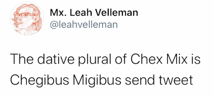

# Old news

## Announcements

- **Nov. 9**:  [Checklist of due dates](./checklist/) has been revised to reflect cancelled class.
- **Nov. 9**:  No homework for today's class.  Please use [this reading assignment for today](./assignments/indirect/) to review material presented in class.
- **Nov. 6**:  I'm continuing to revise the course schedule to account for our cancelled class. Please [complete a first draft of composition 3](./assignments/composition3/) for **Wed., Nov. 11**.
- **Nov. 4**: CLASS CANCELLED. Assume that Friday's class (Nov. 6) will be the introduction to our next composition originally planned for today. (Further details shared by email.)
- **Nov. 2**: See [breakout room challenge for today's class](./breakouts/)
- **Nov. 2**:  No classes on Tuesday, Nov. 3, so **no practicum** this week (Monday, Nov. 2, or Tuesday, Nov.3)!
- **Nov. 2**:  [master vocabulary list for F20](https://lingualatina.github.io/textbook/vocabulary/00-master/)
- **Oct 30**: [checklist with due dates of all assignments](./checklist/)
- [Old news](./oldnews/)
- **Oct. 26**: please post a draft of [translation 3](../assignments/translation3/) before coming to Wednesday's class, when we'll workshop the assignment in groups
- **Oct. 23**: for breakout sessions, complete *synopses* in the *third person*: both singular and plural, active and passive, and test yourself with [this self-correcting notebook](https://observablehq.com/@neelsmith/lingua-latina-legenda-unit-2-verb-synopsis?collection=@neelsmith/l3)
- **Oct. 17**:  updated schedule includes
[self-corrected assignment on gerund and infinitive](../assignments/review-verbal-nouns/)
- **Oct. 16**: for breakout session: [first draft of assignment using gerunds and infinitives](../assignments/gerund/exercise/).
- **Oct. 14**: assignments and slides used in class updated;  try to complete and submit [self-corrected assignment on gerundives](../assignments/gerundive/exercise/).
- **Oct. 14**: reminder: no regular drop in hours on Thursday, Oct. 15.
- **Oct. 14**: interactive web page to test yourself on [noun-adjective agreement](https://observablehq.com/@neelsmith/lingua-latina-legenda-unit-1-quiz-yourself-on-forms)
- **Oct. 12**: [overview of unit 2](../schedule/part2/) available
- **Oct. 12**: updated [guide to reading a Latin text](../reading/)
- **Oct. 12**: interactive web page to test yourself on [recognizing forms from unit 1 vocabulary](https://observablehq.com/@neelsmith/lingua-latina-legenda-test-yourself-on-unit-1-vocabulary?collection=@neelsmith/l3)
- **Oct. 10**:  you  may laugh or groan, but if you have no response to this tweet, you need to review the third declension.

- **Oct. 8**:  revised version of all [slides in used unit 1](../slides/) available
- **Oct. 7**:  vocabulary quiz 2 now posted on Moodle: all self-corrected exercises for Unit 1 available
- **Save the date**!  Guest visit with Phuc Tran, **Tues. Oct. 20 at 4:45**.  (Zoom link will be shared later.)  Watch his TedX talk, "Grammar, Identity, and the Dark Side of the Subjunctive."  

<iframe width="560" height="315" src="https://www.youtube.com/embed/zeSVMG4GkeQ" frameborder="0" allow="accelerometer; autoplay; clipboard-write; encrypted-media; gyroscope; picture-in-picture" allowfullscreen></iframe>

- **Oct. 7**: [breakout questions](../breakouts/)
- **Oct. 7**: unit 1: [revised timeline of deadlines for assessment](../schedule/part1/timeline/)
- **Oct. 7**: an approach to [reading a Latin text](../reading/)
- **Oct. 7**: complete assignment for [translation 2](../assignments/translation2/) now available.
- **Oct. 6**: [slides from class](../slides/) updated
- **Oct. 2**: Monday, Oct. 5, is Zoom-free Monday for first-years and sophomores!
- **Oct. 2**: Introduction to [second translation assignment](../assignments/translation2/)
- **Sept. 25**:  First [composition assignment](../assignments/composition1/) available.
- **Sept. 23**: first contributions to "Identify that character!" project [published as part of *Lingua Latina Legenda* course material](https://lingualatina.github.io/courses/)
- **Sept. 21**: vocabulary quiz 1 available on Moodle
- **Sept. 18**: breakout questions for [practice vocabulary exam](../breakouts/)
- **Sept. 18**: example of [automatically formatted web page](../assignments/prosopography/sampleoutput/) from "Identify that character!" assignment.
- **Sept. 16**:  [first translation assignment posted](../assignments/translation1/)
- **Sept. 15**:  [class wiki available](../wiki/). (Also linked from [course resources page](../resources/).)
- **Sept. 14**:  [challenges for breakout rooms](../breakouts) today
- **Sept. 13**:   [Summary of regular forms](../schedule/part1/forms/) covered in Unit 1 now complete.  Note that you should also learn the irregular forms of *hic, haec, hoc*, *is, ea, id*, *ille, illa, illud*, and *ipse, ipsa, ipsum*, using the [paradigms in the L3 textbook](https://lingualatina.github.io/textbook/reference/pronouns-paradigms/).
- **Sept. 12**:  See the [practicum/CBL page](../practicum/) for one-time Zoom links to this week's practicum meetings, and preparatory reading.
- **Sept. 11**:  Moodle updated: self-corrected exercise in  for "[more nouns](assignments/nouns2/exercise/)" assignment now has correct answers (!), exercise for "[nouns](assignments/nouns/exercise/)" includes additional altenative answer.
- **Sept. 10**: updates include:
    - new page with [assignments and Zoom links for practicum sections](../practicum/)
    - updated [calendar for Unit 1](../schedule/part1/schedule/)
    - summaries of [vocabulary](schedule/part1/vocab/) and [forms](schedule/part1/forms/) covered in Unit 1
    - [slides from class meetings](../slides/)
- **Sept. 4**: brief [guide to standard American pronouncation of Latin](../resources/pronounciation/) in resources section

## Week at a glance

- Week of **Oct. 26-30**: Questions, including deliberative questions with the subjunctive.
- Week of **Oct. 19-25**:  Workshop on composition 2. Introduce the present indicative, and all three persons of present, imperfect and perfect indicative; verb synopses.
- Week of **Oct. 12-16**:  prepositional phrases; the gerundive and expressions of purpose.
- Week of **Oct. 5-9**: Small-group and full-class workshops on composition assignment 1 and translation assignment 2.
- Week of **Sept. 14-18**: Adjectives, pronouns and proper names in Hyginus. One self-corrected exercise ([adjectives and pronouns](../assignments/demonstratives/exercise/)); one exercise submitted as a Google form ([identify that character!](../assignments/prosopography/))
- Week of Sept. 7-11: adjectives in  Latin, including two self-corrected exercises: [nouns (part 2) ](../assignments/nouns2/exercise/), and [adjectives](../assignments/adjectives/exercise/).
