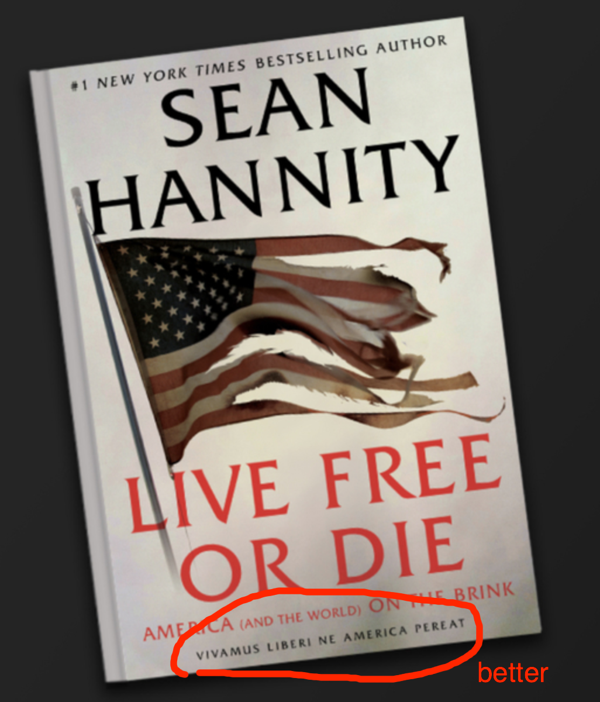

# Latin 101, section 1

# <https://neelsmith.github.io/latin101/>

---

# Agenda

- Mechanics
- Course etiquette
- Greetings
- Course overview
    - Assignments, assessment
    - CBL  - why and how
- Unit 1: Latin is an inflected language

---

# Mechanics: Zoom

- mute audio by default
- keep chat stream open
- also use Zoom reactions
- please keep video on if you like!

---

# Mechanics: course web site

Some key parts of the site:

- **[home page](https://neelsmith.github.io/latin101/)** has announcements and week at a glance
- **schedule** has links to daily assignments
- **search box** (top of every page)  also useful!

---

# Etiquette to emphasize in F20

- flexibility
- patience with each other
- communicating/connecting takes effort!

## Biggest take-away from survey forms

> *Form small groups outside of class!*

---

# Meeting each other

Break-out groups, two reporters to bring back to whole group:

1. one interesting fact to introduce each member of your group
2. suggest at least one way to form study groups outside of class

---

# Highlights from course site

- All assignments can be revised (up to unit deadline)
- CBL integral to course

---

# Studying Latin as a form of privilege

-  can convey real, transferable skills:
    - with languages
    - with cultural understanding
- but also can be gatekeeper to other privileges/power

---

**Vivamus vel libero perit Americae**

> ?? Let’s live or s/he passes away from America for the detriment of a free man??

([Spencer Alexander McDaniel](https://talesoftimesforgotten.com/2020/05/16/sean-hannity-does-not-know-latin/), Junior Classical Studies/History major at Indiana University, Bloomington)

---

**Vivamus liberi ne America pereat**

> Let us live as free people so that America does not perish.

---

# Latin: what kind of authority?

Why a Latin motto?

Why not Spanish?  or Chinese?

> (Footnote: McDaniel: Latin gobbledy gook = Google Translate output!)

---

# Inflection vs. word order

---

# Is it news?

English expresses syntax by *word order*: **subject-verb-object** (SVO)

Not news:

> Dog bites man.

News:

> Man bites dog!

---

# Latin nouns: find declension from vocabulary entry

- second form is *genitive singular*:
- *ending* tells you *declension*

| Ending | Declension | Example |
| --- | ---  | --- |
| -**ae** | 1st | filia, fili**ae**, *f.*, "daughter" |
| -**i** | 2nd | filus, fili**i**, *m.*, "son" |
| -**is** | 3rd | homo, homin**is**, *m.*, "person" |

---

# Accusative: the **target** case

| Declension | Singular | Plural |
| --- | --- | --- |
| 1st | -*a***m** | -*a***s** |
| 2nd | -*u***m** | -*o***s** |
| 3rd | -*e***m** | -*e***s** |

---

# Vocabulary

Two **third-declension** nouns:

> canis, can**is**, *m.*, "dog"
> homo, homin**is**, *m*, "person"

---

# Latin expresses syntax by **form**

Not news:

> Dog bites man.
> Canis homin**em** mordet.
> Homin**em** canis mordet.

News:

> Man bites dog.
> Can**em** homo mordet.
> Homo can**em** mordet.

---

# Latin word order is *not* random!

A frequent pattern:

- subject-object-verb (SOV) **canis hominem mordet**.

Other possibilities:

- object-subject-verb (OSV) **hominem canis mordet**.
- verb-object-subject (VOS) **mordet hominem canis**.

---

# What does it mean?

- less common patterns *always* call your attention to something less expected
- slight difference in emphasis?
