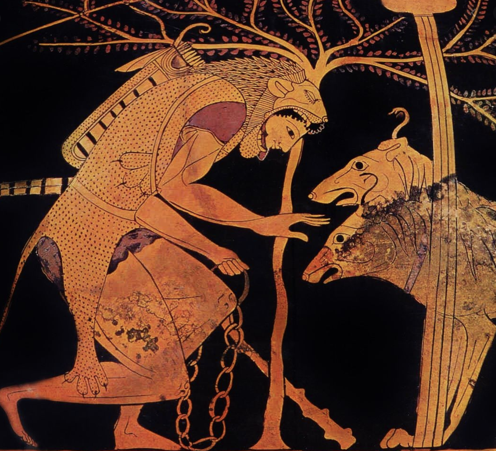
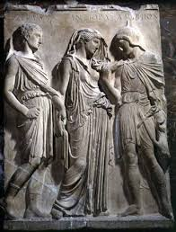

# Principle parts

- present system (1, 2): *stem depends on conjugation*
- perfect system (3, 4): *all conjugations work the same*

---

# Comparing present stems

| conjugation | present     | imperfect |
| :------------- | :------------- |  :------------- |
| 1: amo, am**ā**re      | am**a**t       | am**a**bat |
| 3: duco, duc**e**re | duc**i**t | duc**e**bat |
| 3-io: cap**io**, cap**e**re | cap**i**t | cap**ie**bat |

---

# Questions

---

# Yes/no

Hercules**ne** canem eduxit?

> **Sic**, Hercules canem eduxit.

---

# Yes/no

Canem**ne** Hercules  eduxit?

---

# Interrogative adjective

quis, quid

----

# Adjective: which one?

Hercules **quem** canem eduxit?

> Hercules **tricipitem canem Cerberum** eduxit.

---

canem Hercules eduxit.

 **Quem** canem Hercules eduxit?

> Hercules **tricipitem canem Cerberum** eduxit.

---

# Pronoun: who, what ?

**Quis** canem eduxit?

> **Hercules** canem eduxit.

---

# Case shows function

Hercules **cui** canem eduxit?

> **Eurystheo**.

---

Orpheus **quem** eduxit?

> Orpheus **Euryidicem** eduxit.

---

---
