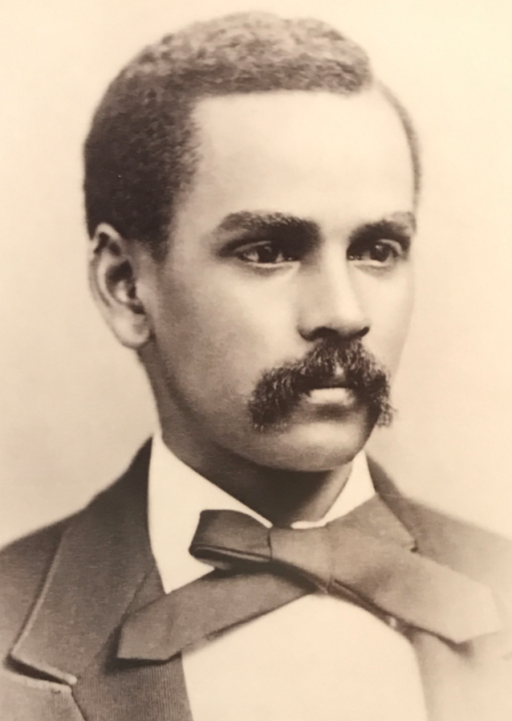
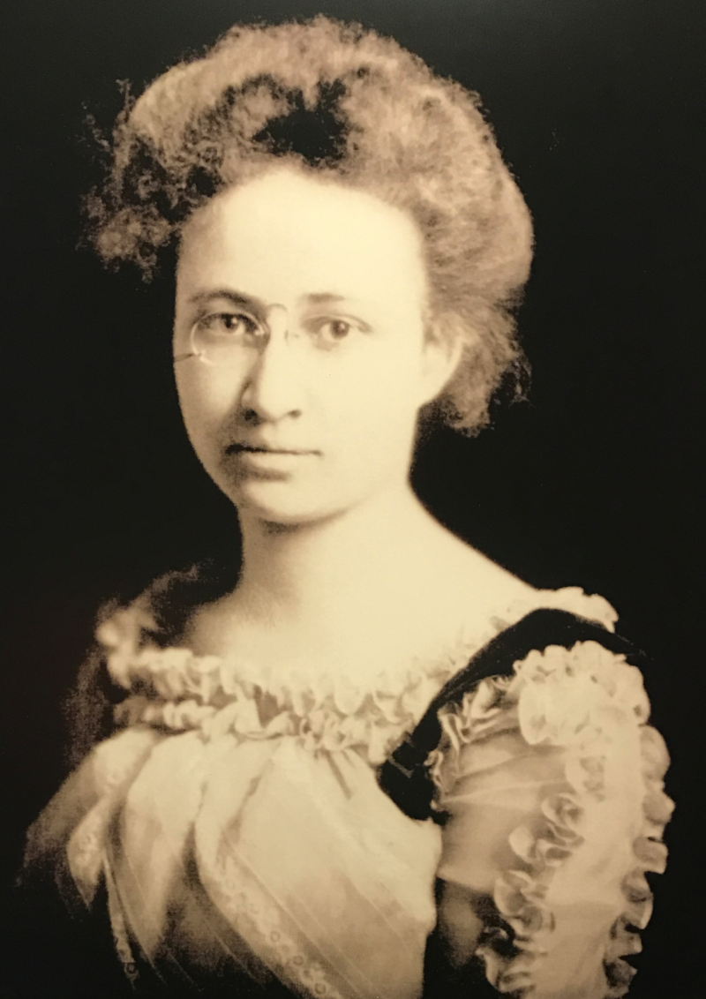
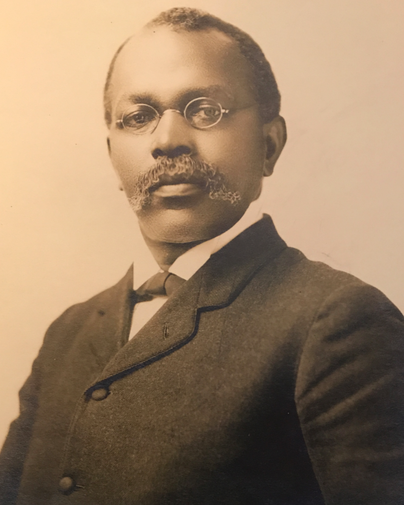
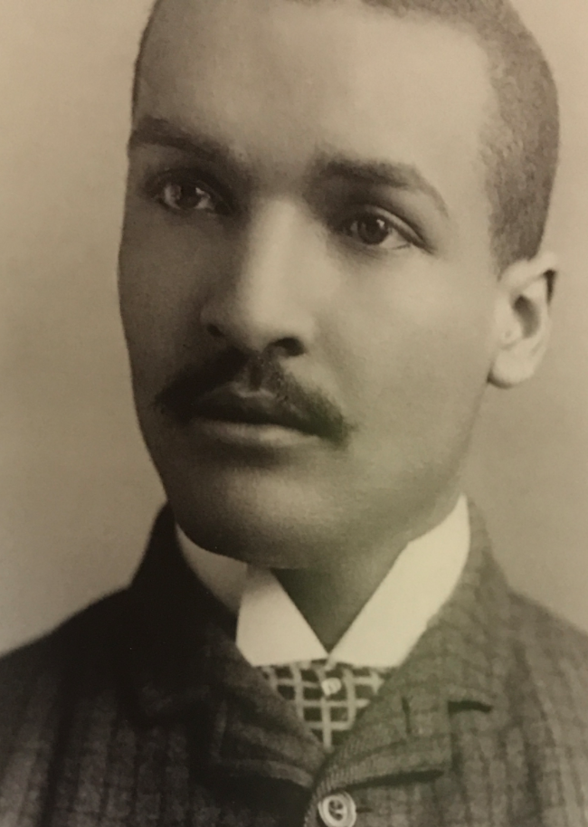
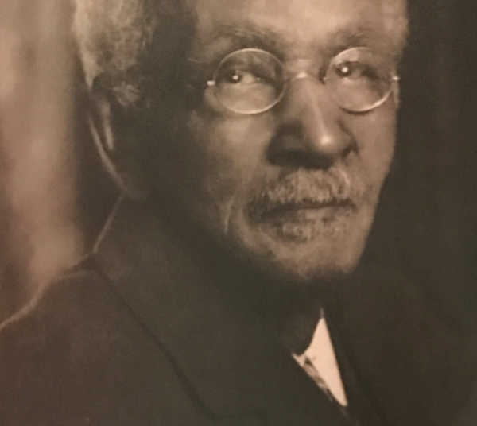
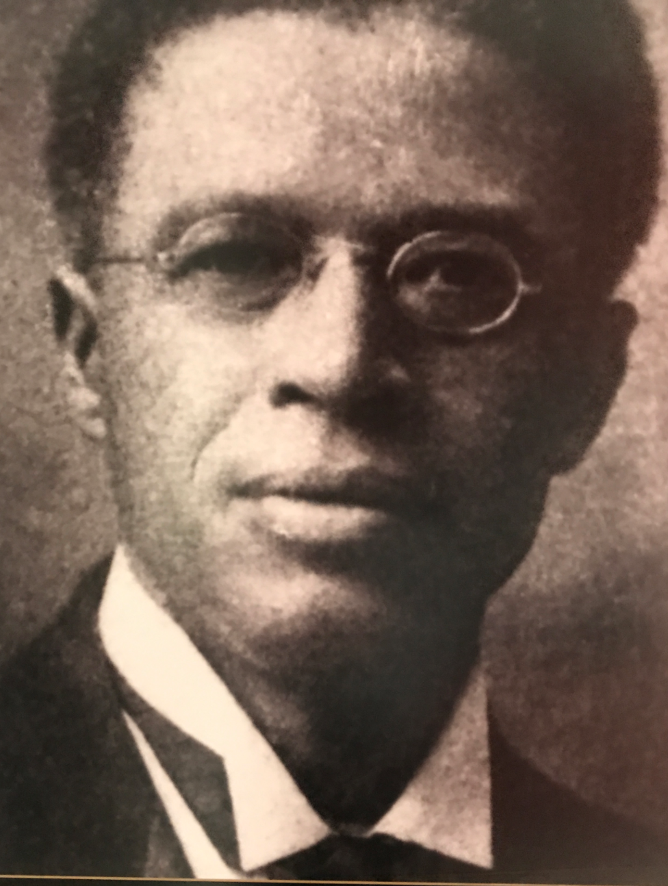
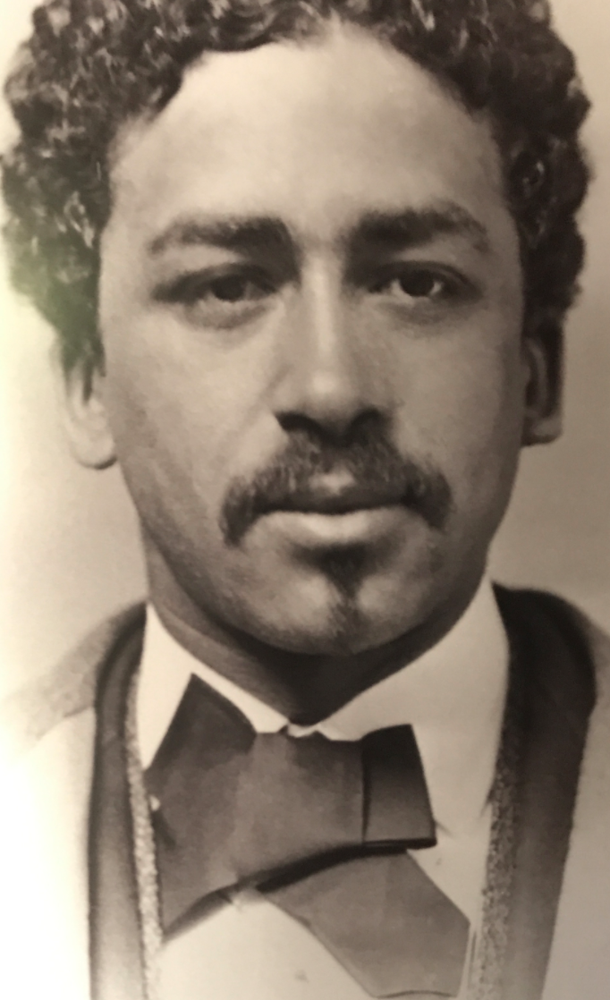
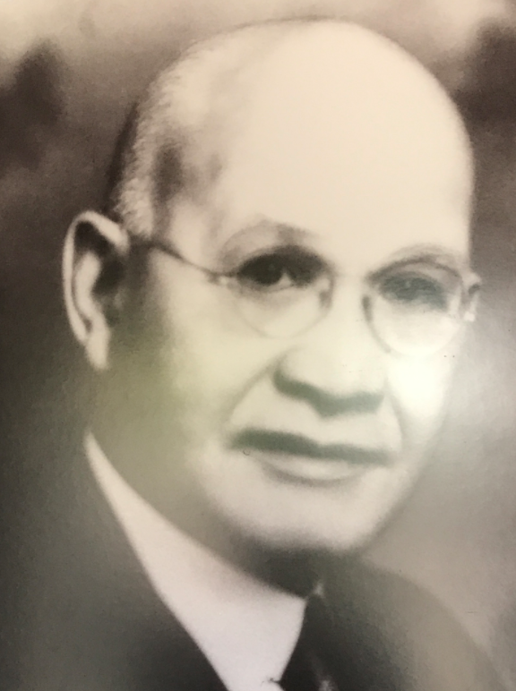
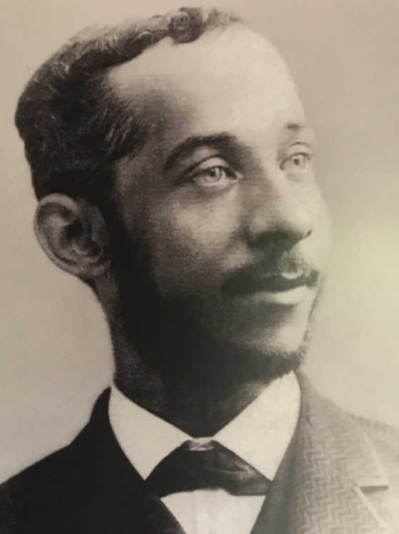
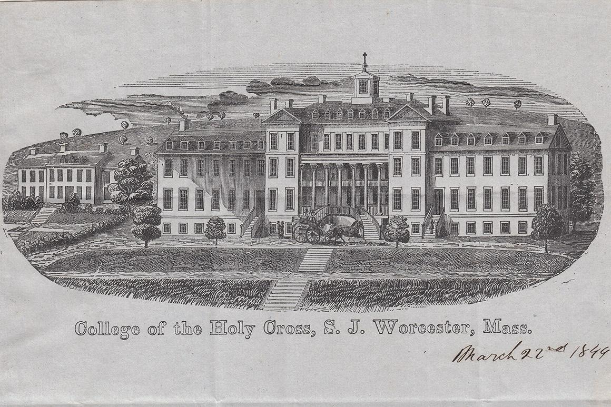

# Exhibit, “15 Black Classicists"

## Howard University Sesquicentennial (2017)

---

# Temporary display, Washington, DC, 2018

-  the Blackburn Gallery of Art, Howard University
-  the Center for Hellenic Studies (Harvard University)

---

# MA connections

- selection of 15 influential Black scholars and teacher of Classics
- at least 3/4 have direct link to Mass.

---

# Wiley Lane

- Phi Beta Kappa, **Amherst**, 1879
- Professor of Greek, Howard University,  1883

---

# Helen Maria Chestnutt

- BA, **Smith College**, 1902
- MA, Columbia, 1925
- Latin teacher, Central High, Cleveland
    - pupil: Langston Hughes
- author of textbook, *The Road to Latin*, 1932    

---

#  John Wesley Edward Bowen

- born into slavery 1855
- Ph.D. **Boston University** 1887 (second Black American to earn a Ph.D. in the U.S.)

---

# John Wesley Gilbert

- born 1864, Hephzibah, Georgia, son of slaves
- BA, MA in Greek, **Brown University**
- 1890: first Black to attend American School of Classical Studies, Athens

---

# William Henry Crogman

- born 1841, the Leeward Islands
- 1873, graduated from Atlanta University
- Professor of Greek at **Clark University** (Worcester) for more than 40 years
- 1903-1910, President, **Clark University**

---

# Reuben Shannon Lovinggood

- born 1864, Walhalla, SC
- graduated with honors, **Clark University**, 1890
- President, Huston College (Austin, TX)

---

# Richard Theodore Greener

- schooled at **Philips Academy**
- 1870, BA, **Harvard Univeristy** (first Black American to earn a BA from Harvard)

---

# George Morton Lightfoot

- born, Culpeper, VA
- BA, **Amherst College**,  1891
- 1912, Professor of Latin, Howard University

---

# Daniel Barclay Williams

-  born 1861, Richmond, VA
- graduated **Worcester Academy**,  1880
- matriculated, **Brown University**
- Professor of Ancient Languages, Virginia Normal and Collegiate Institute (now Virginia State University): first state institution in Virginia to offer blacks a classical education.

---

# Where is Holy Cross?

---
