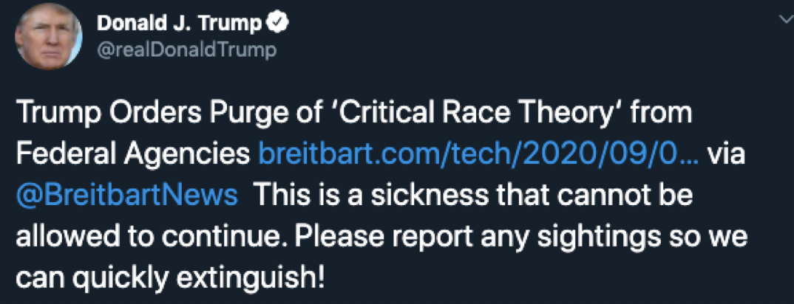
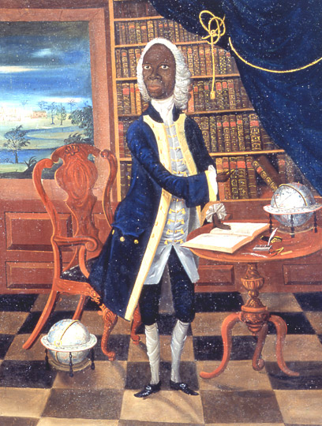
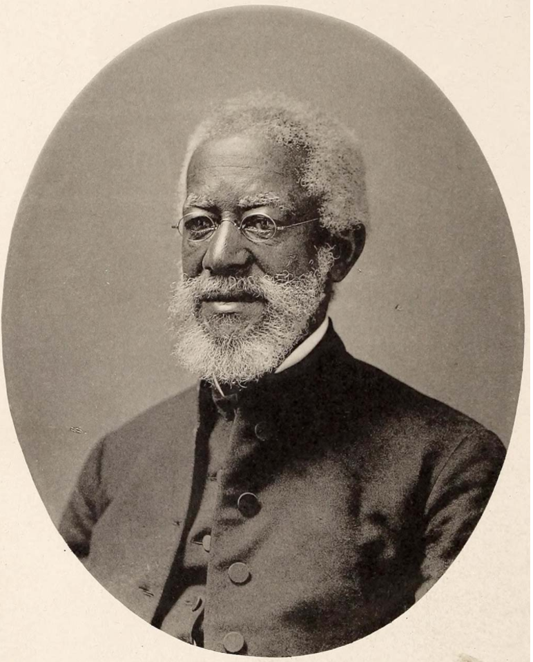
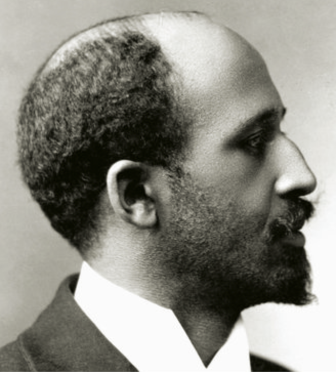

# `#scholarstrike`

---

# A timetable

- August 26: NBA strike
- Sept. 4:  labor leaders authorize work stoppages
- Sept. 8-9: `#scholarstrike`

---

# What can education do? understanding

Critical theory:

- racism is systemic
- not just result of individual racist actions
- implicit bias affects our actions
- privilege blinds us to how it works

---

# What can education do? skills

- empathy
- communication
- inclusion

---

# September 4: a "sickness"?

---

# Latin

- can be used to exclude
- can be used to resist oppression

---

# Role of CBL in Latin study?

---

# Exclusion

- "Classics" study of "the best", for "the best"

---

# Hume, "Of National Characters" (1758)

> I am apt to suspect the negroes...to be naturally inferior to the whites.
> In JAMAICA, indeed, they talk of one negroe as a man of parts and learning; but ’tis likely he is admired for very slender accomplishments, like a parrot, who speaks a few words plainly.

(Referring to Francis Williams)

---

# Alexander Crummell

- Episcopal clergyman
- 1898 speech, "The Attitude of the American Mind toward the Negro Intellect"

---

>One of the utterances of Mr. Calhoun was ... “That if he could find a Negro who knew the Greek syntax, he would then believe that the Negro was a human being and should be treated as a man.”

>... Mr. Calhoun went to “Yale” to study the Greek Syntax... His son went to Yale to study the Greek syntax... His grandson, in recent years, went to Yale, to learn the Greek Syntax...

>School and Colleges were necessary for the Calhouns, and all other white men to learn the Greek syntax. And yet this great man knew that there was not a school, nor a college in which a black boy could learn his A, B, C’s. He knew that the law in all the Southern States forbade Negro instruction under the severest penalties.

---

# Resistance

---

# W.E.B. DuBois, *Souls of Black Folk* (1903)

"Student-teaching" in Alexandria, TN:

> When the Lawrences stopped [coming to school], I knew that the doubts of the old folks about book-learning had conquered again, and so, toiling up the hill, and getting as far into the cabin as possible, I put Cicero *pro Archia Poeta* into the simplest English with local applications, and usually convinced them -- for a week or so.

---

# Cicero, *Pro Archia*

- court speech
- defends Archias' right to citizenship
- Archias is a Greek immigrant
- his value to society grows from his reading

---

# Cicero as a model for Black Americans

- universality of Latin
- relevant
- significant
- accessible

---

# Education is resistance

---

# Dubois uses Cicero

Speech in 1891:

> Finally, as to the point that men have become great without College degrees, I answer as Cicero answered two thousand years ago: I do not deny that great and useful men have existed who never had a College education, nor do I deny that genius without learning avails more than learning without genius.
>
> But this I do affirm: that when genius is added to the developing and moulding power of a collegiate education, then look for a *man*.

---

# Cicero, *Pro Archia*, 7

"I admit that many men have existed of admirable disposition and virtue"

> homines excellenti animo ac virtute

---

# Exhibit, “15 Black Classicists"

## Howard University Sesquicentennial (2017)

---

# Temporary display, Washington, DC, 2018

-  the Blackburn Gallery of Art, Howard University
-  the Center for Hellenic Studies (Harvard University)

---

# MA connections

- selection of 15 influential Black scholars and teacher of Classics
- at least 3/4 have direct link to Mass.

---

# Wiley Lane

- Phi Beta Kappa, **Amherst**, 1879
- Professor of Greek, Howard University,  1883

---

# Helen Maria Chestnutt

- BA, **Smith College**, 1902
- MA, Columbia, 1925
- Latin teacher, Central High, Cleveland
    - pupil: Langston Hughes
- author of textbook, *The Road to Latin*, 1932    

---

#  John Wesley Edward Bowen

- born into slavery 1855
- Ph.D. **Boston University** 1887 (second Black American to earn a Ph.D. in the U.S.)

---

# John Wesley Gilbert

- born 1864, Hephzibah, Georgia, son of slaves
- BA, MA in Greek, **Brown University**
- 1890: first Black to attend American School of Classical Studies, Athens

---

# William Henry Crogman

- born 1841, the Leeward Islands
- 1873, graduated from Atlanta University
- Professor of Greek at **Clark University** (Worcester) for more than 40 years
- 1903-1910, President, **Clark University**

---

# Reuben Shannon Lovinggood

- born 1864, Walhalla, SC
- graduated with honors, **Clark University**, 1890
- President, Huston College (Austin, TX)

---

# Richard Theodore Greener

- schooled at **Philips Academy**
- 1870, BA, **Harvard Univeristy** (first Black American to earn a BA from Harvard)

---

# George Morton Lightfoot

- born, Culpeper, VA
- BA, **Amherst College**,  1891
- 1912, Professor of Latin, Howard University

---

# Daniel Barclay Williams

-  born 1861, Richmond, VA
- graduated **Worcester Academy**,  1880
- matriculated, **Brown University**
- Professor of Ancient Languages, Virginia Normal and Collegiate Institute (now Virginia State University): first state institution in Virginia to offer blacks a classical education.

---

# Where is Holy Cross?

---
