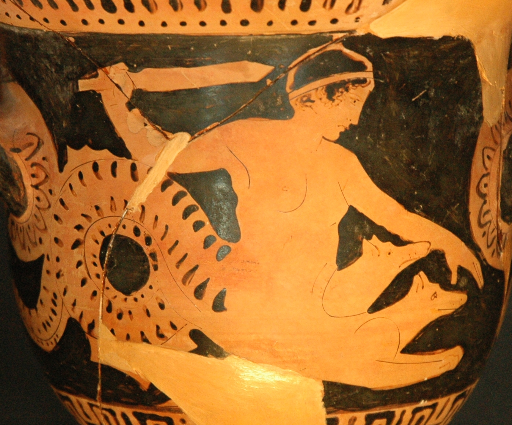

# The  imperfect and perfect indicative

Prof. Smith
Latin 101

---

# Review: finding forms of nouns

- find stem
- apply ending

---

# Example

> Argonauta, -ae, *masculine*.

What is nominative plural?

- Stem *Argonaut*- + ending -*ae* -> *Argonautae*

---

# Verbs: 4 principal parts

|  | 1 | 2 | 3 | 4 |
| --- | --- | --- | --- | --- |
| 1st conjugation | seruo | seru*āre* | seruaui | seruatus |
| 2nd conjugation | habeo | hab*ēre* | habui | habitus |
| 3rd conjugation | duco | duc*ӗre* | duxi | ductus |
| 3rd-io conjugation| facio | fac*ӗre* | feci | factus |
| 4th conjugation| audio | aud*īre* | audiui | auditus |

---

# Imperfect stem: start from second part

|  | 1 | 2 | 3 | 4 |
| --- | --- | --- | --- | --- |
| 1st conjugation | seruo | seruā*re* | seruaui | seruatus |
| 2nd conjugation | habeo | habē*re* | habui | habitus |
| 3rd conjugation | duco | duc*ӗre* | duxi | ductus |
| 3rd-io conjugation| facio | fac*ӗre* | feci | factus |
| 4th conjugation| audio | audī*re* | audiui | auditus |

---

# Imperfect stem: drop/add

- 1, 2: add -ba
    - seruāre -> seruāba-
    - habēre  -> habēba-
- 3: add -ēba- (looks just like 2nd!)
    - ducӗre -> ducēba-
- 3io: add -iēba-  (looks just like 4th!)
    - facӗre ->  faciēba-
- 4:  add -ēba-
    -  audīre -> audiēba-

---

# Endings for third person

| Number | Active | Passive |
| -- | --- | --- |
| Singular | - t  |  - tur |
| Plural | -nt | -ntur |

---

# Third Singular

| Active | Passive |
| --- | --- | --- |
| seruabat  | seruabatur |
| habebat  | habebatur |
| ducebat |  ducebatur |
| faciebat |  faciebatur |
| audiebat |  audiebatur |

---

# Third Plural

| Active | Passive |
| --- | --- |
| seruabant |  seruabant |
| habebant |  habebantur |
| ducebant  | ducebantur |
|  faciebant  | faciebantur |
|  audiebant |  audiebantur |

---

# Perfect *active*:  use third part

Stem: drop -i from third part

|  | 1 | 2 | 3 | 4 |
| --- | --- | --- | --- | --- |
| 1st conjugation | seruo | seruāre | seruau*i* | seruatus |
| 2nd conjugation | habeo | habēre | habu*i* | habitus |
| 3rd conjugation | duco | ducӗre | dux*i* | ductus |
| 3rd-io conjugation| facio | facӗre | fec*i* | factus |
| 4th conjugation| audio | audīre | audiu*i* | auditus |

---

# Endings: perfect active

| Number | Active |
| -- | --- |
| Singular | -it  |
| Plural | -ērunt  or -ēre|

---

# Perfect active

| Singular | Plural |
| ---  | --- |
| seruauit | seruauerunt |
| habuit | habuerunt |
| duxit | duxerunt |
| fecit | fecerunt |
| audiui | audiuerunt |

---

draco  pellem auream arietis seruabat.

> A dragon guarded the golden ram's skin

---

From the table of contents:

Scylla  superiorem partem feminae inferiorem canis habuit.

From the narrative of the text:

Ulixes ad Scyllam Typhonis filiam uenit.  illa sex canes ex se natos habebat.

Odysseus came to Scylla, the daughter of Typhon.  She had six dogs sprouting from her.

---

# Perfect *passive*:  use fourth part

|  | 1 | 2 | 3 | 4 |
| --- | --- | --- | --- | --- |
| 1st conjugation | seruo | seruāre | seruaui | *seruatus, -a, -um* |
| 2nd conjugation | habeo | habēre | habui | *habitus, -a, -um* |
| 3rd conjugation | duco | ducӗre | duxi | *ductus, -a, -um* |
| 3rd-io conjugation| facio | facӗre | feci | *factus, -a -um* |
| 4th conjugation| audio | audīre | audiui | *auditus, -a, -um* |

---

# Add present tense *to be*

- make sure adjective agrees with subject in gender and number
- (what case will the subject always be?)

---

Orestes et Pylades ad regem Thoantem sunt deducti

> Orestes and Pylades were led to king Thoas.

---

# Summary

- Verbs have 4 principal parts
- Use first two parts to form imperfect
- Use third part for perfect active
- Use fourth part for perfect passive

---

# Valēte!

---
