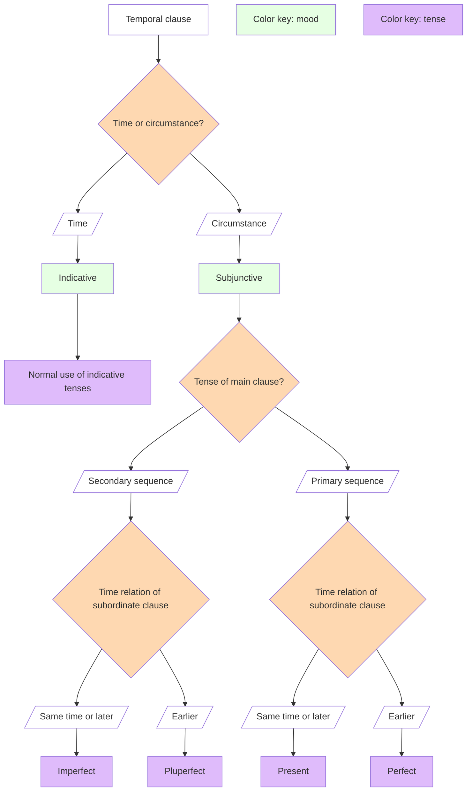

# Latin 101, section 1, F22

This repository hosts the source for the web site for section 1 of Latin 101 at Holy Cross in the fall semester, 2022:  <https://neelsmith.github.io/latin101/>.

All material in this repository is availabe under the terms of the Creative Commons Attribution Share-Alike license, <a href="https://creativecommons.org/licenses/by-sa/4.0/">CC BY-SA 4.0 </a>

