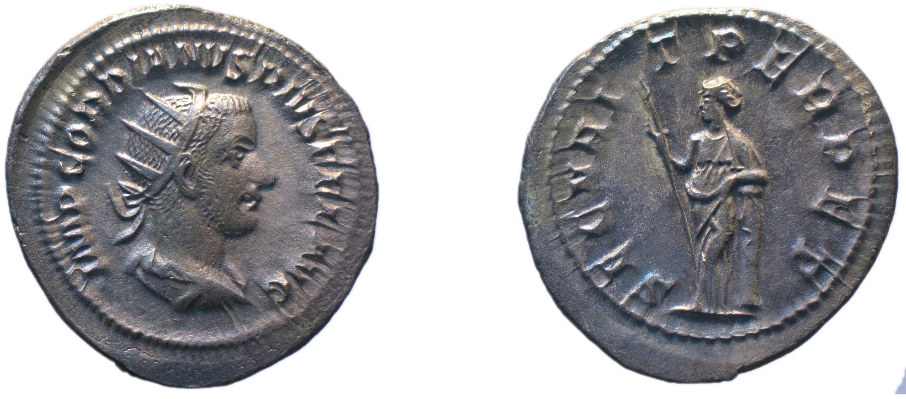

# Adjectives: self-correcting exercise

## Background

These coins do not distinguish *I* from *J*, or *U* from *V*.  A name that you might see spelled *Julia* in a printed edition of a Latin text will be spelled **IVLIA** on these coins, for example.

Names are also nouns, with forms you can identify by gender, case and number. (In fact, the Latin word *nomen* means both "name" and "noun", and is the source for the English word "noun.")

## 1. Recognizing names

Latin dictionaries may not include every name you encounter in your reading, but you can often work out from context what form a name is.  In this section, recall that when Roman imperial coins depict a member of the imperial family, they most frequently *name* the  person in the *nominative* case.  Identify the nominative singular and what you think the genitive singular would be for the following four figures.

(You can follow the links to wikipedia articles to learn more about each figure.)

###  A. Faustina

[Faustina the Elder](https://en.wikipedia.org/wiki/Faustina_the_Elder) was the niece of the emperor Hadrian, aunt of the later emperor Marcus Aurelius, and wife of the emperor Antoninus Pius.  After her early death, he often commemorated her on coins.

| Obverse | Reverse |
| --- | -- |
|  **FAUVSTINA AVG[VSTA] ANTONINI AVG[VSTI] PII FIL[IA]** |  **VENERI FELICI** |

1. Find the nominative singular of her name on the *obverse*:
1. Suggest a genitive singular of her name:

### B. Julia

[Julia Domna](https://en.wikipedia.org/wiki/Julia_Domna) was born in Emesa (modern Homs, in Syria), married Septimius Severus (who was born in Libya)

| Obverse | Reverse |
| --- | -- |
|   **IVLIA AVGVSTA** |  **FORTVNAE FELICI** |

1. Find the nominative singular of her name on the *obverse*:
1. Suggest a genitive singular of her name:

### C. Caracalla

[Caracalla](https://en.wikipedia.org/wiki/Caracalla) was a nickname of Julia Domna's oldest son, Marcus Aurelius Antoninus.  Born in Lugdunum (modern Lyons, France), he was a complex character and controversial emperor.  He passed an edicte that granted Roman citizenship to all free men in the empire.

| Obverse | Reverse |
| --- | -- |
|  **ANTONINVS AVGVSTVS** |  **SECVRIT[AS] ORBIS** |

1. Find the nominative singular of his name on the *obverse*:
1. Suggest a genitive singular of this name:

### D. Gordian

[Gordian III](https://en.wikipedia.org/wiki/Gordian_III), was first recognized as emperor at the age 13!  He lived at a time chaotic time of civil war; at one point in Gordian's reign, as many as five other military commanders simultaneously claimed the title of emperor

| Obverse | Reverse |
| --- | -- |
| **IMP[ERATOR] GORDIANVS PIVS FEL[IX] AVG[VSTVS]** | **SECVRIT[AS] PERPET[VA]**  |

1. Find the nominative singular of his name on the *obverse*:
1. Suggest a genitive singular of this name:

## 2. Multiple cases in the text on coins

In addition to labelling figures using the *nominative* case, coins sometimes link a noun in the *dative* case to an illustration.  In these coins, the text is a kind of dedication, and especially a dedication to a divinity: the illustrated coin is *for* someone.  This gold coin was issued by the emperor Hadrian to commemorate his father, Trajan, who was deified after his death.  (The 2-1-2 adjective *divus*, *divus*, *divum* means "deified".)

### A. Trajan

[Trajan](https://en.wikipedia.org/wiki/Trajan) was born in Spain (near modern Seville), and ruled over the Roman Empire's widest geographic expansion.  During his lifetime, the Senate named him "Best Emperor Ever!" (in Latin, *optimus princeps*).

**DIVO TRAIANO PATRI**

On this coin, you have extra help sorting out the form of Trajan's name, because he is also decribed with a an adjective (**DIVO**) and a noun you already know (**PATRI**).  Since they all describe the same person, they must all be in the same gender, case and number.

1. What is the gender, case and number of all three words in this short text?
1. Suggest a nominative singular of Trajan's name:
1. Suggest a genitive singular of this name:

## Vocabulary

For the subsequent coins in this exercise, refer to this vocabulary list:

**Adjectives**:

- *aeternus, -a, -um*, "eternal"
- *divus, -a, -um*, "deified"
- *pius, -a, -um*, "upright, pious, dutiful"
- *felix, felicis*, "happy, prosperous"
- *navalis, navale*, "naval " (literally, "connected with ships", from *navis, navis*, feminine, "ship")
-  *optimus, -a, -um*, "best" (a superlative form)

**Nouns**:

- *fortuna, fortunae* (feminine), "luck, fate, good fortune"
- *orbis, orbis* (masculine), "globe, the whole world"
- *populus, populi* (masculine), "the people"
- *princeps, principis* (masculine), "leader, ruler"
- *Venus, Veneris* (feminine), the goddess Venus

### B. Julia Domna, reverse

As often, the *reverse* of this coin depicts an abstract concept or personification.  These short texts are like tweets that send an officially sanctioned slogan across the whole empire

| Obverse | Reverse |
| --- | -- |
|   **IVLIA AVGVSTA** |  **FORTVNAE FELICI** |

1. What is the gender case and number of the two words on the *reverse* of this coin?
2. What declension does the noun **FORTVNAE** belong to?
3. What adjective pattern does **FELICI** belong to (2-1-2, 3-termination, 2-termination, or 1-termination)?
4. What do you think the reverse image depicts?

### C. Faustina, reverse

| Obverse | Reverse |
| --- | -- |
|  **FAUVSTINA AVG[VSTA] ANTONINI AVG[VSTI] PII FIL[IA]** |  **VENERI FELICI** |

1. What is the gender case and number of the two words on the *reverse* of this coin?
2. What declension does the noun **VENERI** belong to?
3. What adjective pattern does **FELICI** belong to (2-1-2, 3-termination, 2-termination, or 1-termination)?

The reverse image is a dove, a bird often associated with Venus.  Here, an *attribute* of the goddess stands in for a depiction of her (a rhetorical figure we cal *metonymy*).

### D.  Hadrian

Reverse:

**ROMAE AETERNAE**

1. What is the gender case and number of the two words on the *reverse* of this coin?
2. What declension do you think the noun **ROMAE** belongs to?
3. What adjective pattern does **AETERNAE** belong to (2-1-2, 3-termination, 2-termination, or 1-termination)?

### E. Trajan

**SPQR** is a standard abbreviation for *Senatus Populus-Que Romanus*, "the People and Senate of Roman". (Compare the way we use "USA.")

**S[ENATVS] P[OPVLVS]Q[VE] R[OMANVS] OPTIMO PRINCIPI**

1. What gender, case and number is the noun **POPVLVS**?  Why do you think it is in this case?
1. What noun declension does **PRINCIPI** belong to?
1. What gender, case and number is  **PRINCIPI**?   Why do you think it is in this case?  
1. What adjective pattern does **OPTIMO** belong to (2-1-2, 3-termination, 2-termination, or 1-termination)?
1. What gender, case and number is **OPTIMO** ?
1. What do you think the nouns **POPVLVS** and **PRINCIPI** have to do with the illustration on this coin?

## F. Vespasian

[Vespasian](https://en.wikipedia.org/wiki/Vespasian) emerged as the survivor in a civil war in 68-69 CE that saw four emperors come and go in a year.  He was the first emperor who was not born into a family of senatorial class.  He was probably best known for brutally suppressing a rebellion in the province of Judaea, including the destruction of the Jewish temple in Jerusalem.

On this coin, the abbreviation **SC** means "by decree of the Senate," a formula regularly used on coins of this denominiation, the sestertius, which were paid for by fund controlled by the Senate.  (We'll look at the grammar of this expression a little later this semester.)

**VICTORIA NAVALIS**

1. What do you thik the image depicts?
1. What adjective pattern does **NAVALIS** belong to (2-1-2, 3-termination, 2-termination, or 1-termination)?
1. What gender, case and number do you think **NAVALIS** is?
1. What form do you think the noun **VICTORIA** could be?
