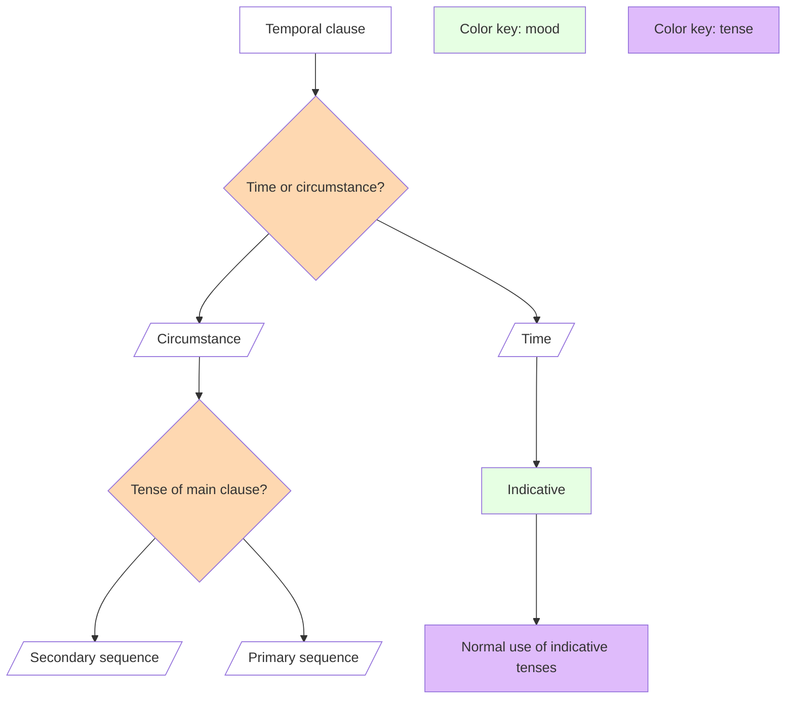

Get your sequence of tenses here!

```mermaid
graph TD

    root[Temporal clause] --> Q1{Time or circumstance?}
    Q1 --> circumstancial[/Circumstance/]
    Q1 --> temporal[/Time/]

    temporal --> indic[Indicative]
    indic --> indictens[Normal use of indicative tenses]

    circumstancial --> Q2{Tense of main clause?}
    Q2 --> secondary[/Secondary sequence/]
    Q2 --> primary[/Primary sequence/]

    k1[Color key: mood]
    k2[Color key: tense]
    

    
    classDef plainwhite fill:#ffffff;
    classDef query fill:#fed8b1;
    classDef mood fill:#e6ffe3;
    classDef tense fill:#dfbbfb;


    class k1 mood;
    class k2 tense;
    class root plainwhite;
    class Q1 query;
    class Q2 query;
    class indic mood;
    class circumstancial plainwhite;
    class temporal plainwhite;
    class primary plainwhite;
    class secondary plainwhite;

    class indictens tense;
```    